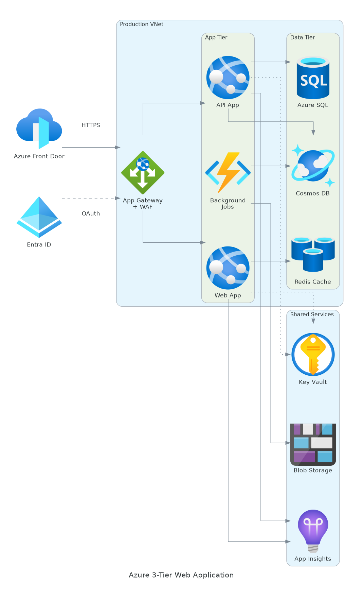

# Cloud Diagram Skill

Generate professional cloud architecture diagrams as PNG images using Python code and official provider icons. Supports Azure, AWS, GCP, Kubernetes, on-premises, and 10+ other providers (2000+ node types).

## What It Does

Turns natural language descriptions of cloud architectures into publication-ready architecture diagrams. Uses the [mingrammer/diagrams](https://github.com/mingrammer/diagrams) library with Graphviz rendering and official service icons for all major cloud providers.

**Supported providers:** Azure (800+ nodes), AWS (500+ nodes), GCP (120+ nodes), Kubernetes, on-premises/open-source, Alibaba Cloud, DigitalOcean, Oracle Cloud (OCI), IBM Cloud, Firebase, Elastic, OpenStack, and more.

## Example Output



*Generated from: "Create a 3-tier Azure web application with Front Door, App Gateway, App Services, Azure SQL, Cosmos DB, Redis Cache, Key Vault, and App Insights"*

## Installation

### Claude.ai (Custom Skills)

Copy the `cloud-diagram/` folder to your Claude skills directory.

### Claude Code

```bash
cp -r cloud-diagram/ ~/.claude/skills/
```

### Other Platforms (Cursor, Windsurf, Codex CLI)

Copy to the appropriate skills directory for your platform, or reference the `SKILL.md` file directly.

### Dependencies

The skill auto-installs these at runtime:

- **Python 3.6+** (pre-installed on most systems)
- **[diagrams](https://pypi.org/project/diagrams/)** -- `pip install diagrams`
- **[Graphviz](https://graphviz.org/)** -- `apt install graphviz` (or `brew install graphviz` on macOS)

## Usage

### Ask Claude Naturally

**Azure:**
> "Draw an Azure hub-spoke network with a firewall in the hub and AKS in the spokes"

**AWS:**
> "Create a diagram of a 3-tier AWS architecture with CloudFront, ALB, ECS, RDS, and ElastiCache"

**GCP:**
> "Visualize a GCP data pipeline with Pub/Sub, Dataflow, BigQuery, and Cloud Storage"

**Kubernetes:**
> "Draw a K8s microservices architecture with Ingress, Services, Deployments, and PVCs"

**Multi-Cloud:**
> "Create a multi-cloud active-active diagram with AWS, Azure, and GCP regions behind a global load balancer"

**On-Prem:**
> "Diagram an on-prem setup with Nginx, Docker, PostgreSQL, Redis, Kafka, and Grafana monitoring"

### Use the Script Directly

```bash
# Generate the default (Azure) example
python scripts/generate_diagram.py

# Generate a specific example
python scripts/generate_diagram.py --example azure
python scripts/generate_diagram.py --example aws
python scripts/generate_diagram.py --example multicloud

# From a JSON specification
python scripts/generate_diagram.py --json my_arch.json --output my_diagram

# SVG output, top-to-bottom layout
python scripts/generate_diagram.py --format svg --direction TB
```

### JSON Specification Format

The JSON spec supports any provider -- just use dotted paths relative to `diagrams.`:

```json
{
    "title": "Hybrid Cloud Architecture",
    "direction": "LR",
    "clusters": [
        {
            "name": "AWS (us-east-1)",
            "nodes": [
                {"id": "alb", "type": "aws.network.ELB", "label": "ALB"},
                {"id": "ecs", "type": "aws.compute.ECS", "label": "ECS Service"}
            ]
        },
        {
            "name": "Azure (East US)",
            "nodes": [
                {"id": "app", "type": "azure.compute.AppServices", "label": "App Service"},
                {"id": "cosmos", "type": "azure.database.CosmosDb", "label": "Cosmos DB"}
            ]
        }
    ],
    "nodes": [
        {"id": "nginx", "type": "onprem.network.Nginx", "label": "Global LB"}
    ],
    "edges": [
        {"from": "nginx", "to": "alb", "label": "HTTPS"},
        {"from": "nginx", "to": "app", "label": "HTTPS"},
        {"from": "ecs", "to": "cosmos", "label": "cross-cloud", "style": "dashed"}
    ]
}
```

### Generate Node References

Use the reference generator to get a full list of available node classes for any provider:

```bash
# Generate references for the main providers
python scripts/generate_node_refs.py --all --output-dir references/

# Generate for a specific provider
python scripts/generate_node_refs.py --provider firebase --output-dir references/

# Generate for every provider in the library
python scripts/generate_node_refs.py --all-providers --output-dir references/
```

## Folder Structure

```
cloud-diagram/
├── SKILL.md                          # Skill definition (agent reads this)
├── README.md                         # This file
├── scripts/
│   ├── generate_diagram.py           # Reusable generation script (multi-cloud)
│   └── generate_node_refs.py         # Node reference file generator
├── references/
│   ├── azure-nodes.md                # Azure node class reference (800+)
│   ├── aws-nodes.md                  # AWS node class reference (500+)
│   ├── gcp-nodes.md                  # GCP node class reference (120+)
│   ├── k8s-nodes.md                  # Kubernetes node class reference
│   └── onprem-nodes.md               # On-premises node class reference
└── assets/
    └── example_3tier.png             # Example output
```

## Supported Diagram Types

- **Architecture overviews** -- 3-tier, microservices, serverless, event-driven
- **Network topology** -- hub-spoke, mesh, hybrid connectivity, VPN/peering
- **Landing zones** -- enterprise-scale, CAF-aligned, multi-account
- **Data pipelines** -- ETL, streaming, analytics, data lake
- **CI/CD pipelines** -- DevOps, GitHub Actions, GitLab CI, ArgoCD
- **Security architectures** -- zero-trust, identity, WAF/firewall
- **Kubernetes** -- microservices, ingress, stateful workloads
- **Multi-cloud** -- active-active, failover, hybrid on-prem + cloud
- **IoT solutions** -- edge, ingestion, processing

## License

Apache 2.0 -- see [LICENSE](../LICENSE)
